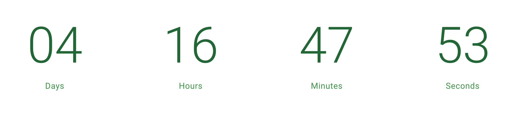

# Vue Count Down Clock Component
## Note: The clock was built for use with Vuetify so some of the Vuetify classes are in play but can be easily replaced with whatever you're using.

---

Available props:
- "date" (required format: "2021-09-27T09:00:00Z")
- "numberColor"
- "textColor"

